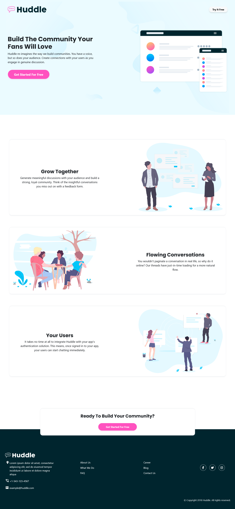

# Huddle Landing Page with Alternating Feature Blocks

This project is a landing page for Huddle and a challenge from [Frontend Mentor](https://www.frontendmentor.io/challenges/huddle-landing-page-with-alternating-feature-blocks-5ca5f5981e82137ec91a5100).

## Table of contents

- [Overview](#overview)
  - [Screenshot](#screenshot)
  - [Links](#links)
- [My process](#my-process)
  - [Built with](#built-with)
  - [Technologies Used](#technologies-used)
- [Author](#author)

## Overview

### Screenshot

### Links

- GitHub Repo: [Solution](https://github.com/basemsameh/Huddle-landing-page-with-alternating-feature-blocks.git)
- Live Site URL: [Demo](https://basemsameh.github.io/Huddle-landing-page-with-alternating-feature-blocks/)

## My process

### Built with:

- **Responsive Design**: The landing page is designed to be fully responsive, providing a consistent experience across different devices and screen sizes.
  
- **Hero Section**: The header section includes a hero image and content welcoming users to the platform and inviting them to get started for free.

- **Content Sections**: There are four content sections:
  
  1. **Grow Together**: Highlights the ability to generate meaningful discussions and build a strong community.
  2. **Flowing Conversations**: Emphasizes the natural flow of conversations without pagination.
  3. **Your Users**: Explains how easy it is to integrate Huddle with an app's authentication solution.
  4. **Ready To Build Your Community?**: Prompts users to get started for free.

- **Footer**: The footer section includes contact information, links to different sections of the website, and social media icons for easy navigation and sharing.

### Technologies Used

- HTML
- CSS
- Bootstrap (for styling)

## Author

- Linkedin - [Basem Sameh](https://www.linkedin.com/in/basem-sameh-671b5b212/)